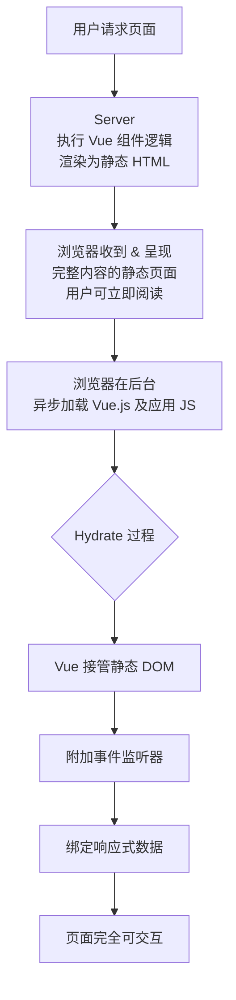

好的，这是一个非常核心且重要的前端概念。我会用尽可能清晰的方式为您解释。

### 核心概念：什么是 "Hydrate"（水合）？

想象一下一个塑料模型玩具：
- **服务器端渲染**：就像厂家已经帮你把模型拼好了，看起来完全就是最终的样子，但它是个**静态模型**，不能动，没有功能。
- **Hydrate**：就像你给这个拼好的模型装上电池和马达。**外观没有变化**，但它现在可以走路、发光、发出声音了，变成了一个**动态的、可交互的**玩具。

在技术层面，**Hydrate** 指的是在客户端，将JavaScript逻辑（事件处理、状态管理、交互功能）“附加”或“激活”到服务器已经渲染好的静态HTML上的过程。

### 为什么需要 Hydrate？（它解决的问题）

1. **首屏加载性能**：
   - **传统SPA**：浏览器先下载一个空的HTML和一大包JS，然后JS执行，再渲染出页面。这期间用户会看到白屏。
   - **SSR + Hydrate**：浏览器直接收到一个渲染好的完整HTML，可以**立即展示内容**（消除了白屏时间）。然后JS包下载好后，再通过Hydrate将其“激活”。

2. **SEO**
   - 搜索引擎爬虫可以直接抓取到服务器返回的完整HTML内容，而不需要等待JavaScript执行。这对搜索引擎优化至关重要。

3. **用户体验**
   - 用户能更快地看到内容，特别是对于网速慢或设备性能差的用户。

### 工作流程：从 SSR 到 Hydrate

我们通过一个流程图来清晰地看懂整个工作过程：

### 在什么情况下使用？

主要使用在以下架构中：

1. **SSR**：如 Nuxt.js, Next.js (React), Angular Universal 等框架的核心流程。
2. **静态站点生成**：如 VuePress, VitePress, Gatsby。它们在构建时生成HTML，然后在浏览器中Hydrate。

### 潜在的问题与优化

Hydrate不是完美的，它也有代价：

- **可交互时间延迟**：虽然内容看到了，但要等到JS下载和执行完才能交互（比如点击按钮）。
- **CPU消耗**：在客户端，Vue需要遍历整个现有的DOM树，并与虚拟DOM进行“对比”，这个过程在复杂的页面上可能引起主线程阻塞，导致页面短暂无响应。

为了解决这些问题，产生了更高级的模式：

- **Partial Hydration**：只激活页面中关键交互部分（如导航栏、按钮），其余部分保持静态。
- **Islands Architecture**：将页面视为由多个独立的、可交互的“岛屿”组成，每个岛屿独立地进行Hydrate。

---

### 关于 "胶水" 这个说法

“胶水”是一个很形象的比喻，通常指**将不同部分连接在一起，使其协同工作的代码或技术**。

在前端语境中：

- **Vue 本身可以被看作是一个“胶水层”**：因为它将你的数据（JavaScript）和视图（HTML/DOM）“粘合”在一起。你修改数据，视图自动更新。
- **Hydrate 过程也是一个“胶水”**：它将服务器端的静态HTML和客户端的动态JavaScript逻辑“粘合”在一起。
- **用于集成其他库的代码**：比如你用一段JavaScript将一个传统的jQuery插件“粘”到你的Vue组件里，这段代码就可以被戏称为“胶水代码”。

### 总结

| 术语 | 比喻 | 作用 |
| :--- | :--- | :--- |
| **Hydrate（水合）** | **给拼装模型装上电池** | 将交互逻辑“激活”到服务器渲染的静态HTML上，使其成为可交互的SPA。 |
| **胶水代码** | **粘合剂** | 连接不同系统、库或层级的代码，使其能够协同工作。 |

希望这个解释能帮助您彻底理解这两个概念！它们是现代高性能前端架构的基石。